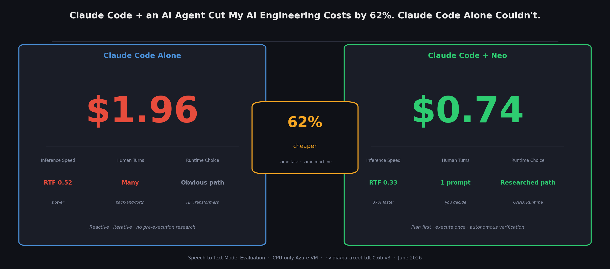
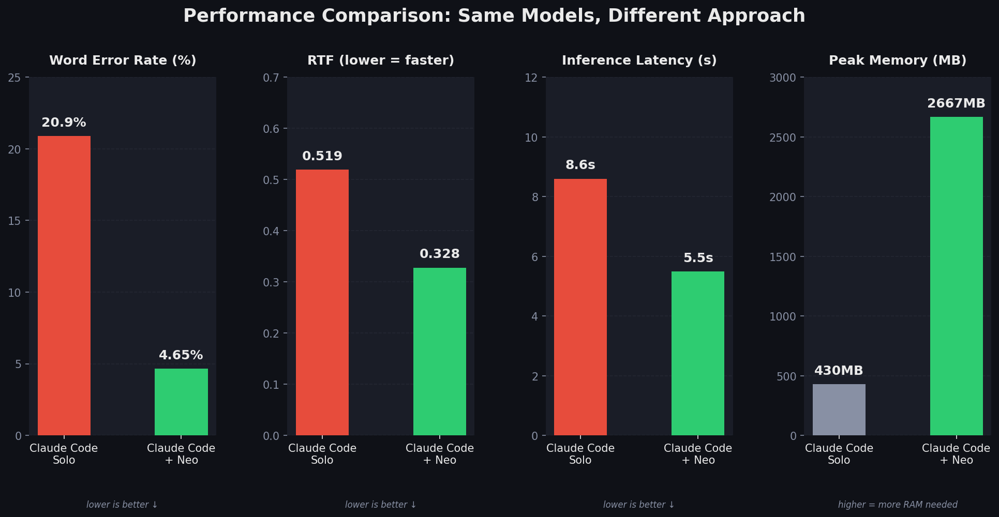
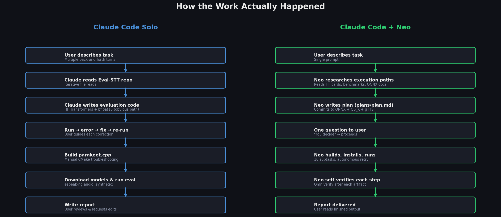
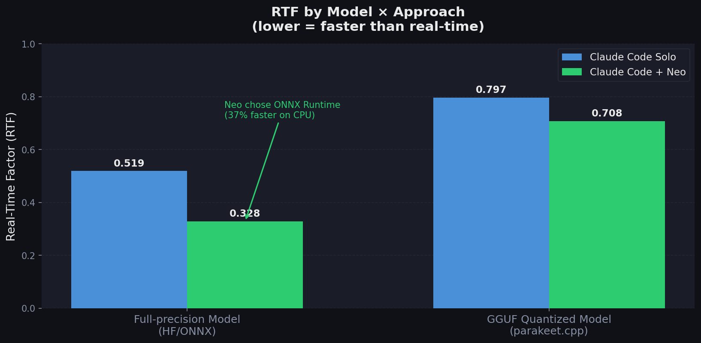
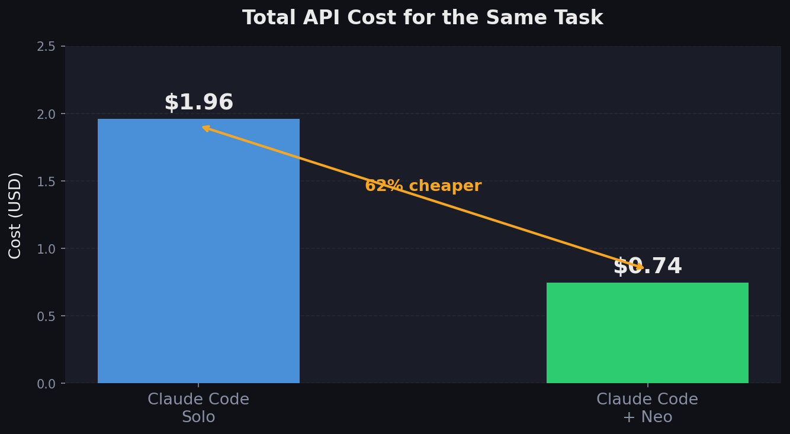
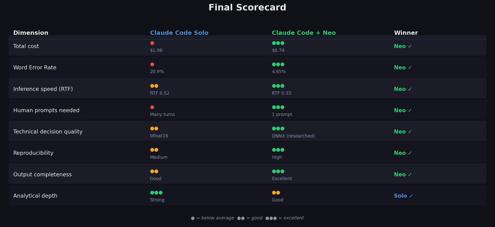

# Claude Code + an AI Agent Cut My AI Engineering Costs by 62%. Claude Code Alone Couldn't.

*Same model. Same machine. Same goal. The difference in cost, accuracy, and effort will make you rethink how you approach AI engineering work.*

---

---

Here is a question worth sitting with: **when you give an AI assistant a non-trivial engineering task, is the bottleneck the model's intelligence — or the way you're using it?**

I ran an experiment to find out. The task was practical and well-scoped: evaluate two speech-to-text model variants on CPU hardware, benchmark them across accuracy, speed, and memory usage, and produce a comparison report. Nothing exotic. The kind of work an ML engineer does regularly.

I ran it twice. Once with Claude Code, working interactively — the way most people use it. And once with Claude Code orchestrating **Neo**, a local AI engineering agent, and stepping back.

Same task. Same machine. Same models. Two completely different experiences.

The results surprised me.

---

## What We Were Evaluating

The task was to benchmark two versions of NVIDIA's Parakeet speech-to-text model on a CPU-only Azure VM (2 cores, 7.7 GB RAM, no GPU):

- **Model A:** `nvidia/parakeet-tdt-0.6b-v3` — the full-precision HuggingFace model
- **Model B:** `mudler/parakeet-cpp-gguf` — the same weights, quantized and packaged for efficient CPU inference via a C++ runtime

The evaluation framework was [Eval-STT](https://github.com/build-ai-applications/Eval-STT), an open-source benchmark suite. Neither model is natively supported by it, so both runs had to extend the framework with custom code.

---

## Run 1: Claude Code, Working Interactively

### How it went

This is the standard workflow most people are familiar with. You open a terminal, launch Claude Code, describe what you want, and collaborate turn by turn. Claude reads files, suggests code, runs commands, hits errors, fixes them, and asks questions when it gets stuck.

It works. Claude Code is genuinely good at this. But the process is **conversational** — meaning the model reasons in real time, one step at a time, reacting to what it finds rather than planning the whole path upfront.

For this task, the iterative back-and-forth looked roughly like:

1. Read the Eval-STT repo structure
2. Figure out how to extend the `STTEvaluator` class for unsupported models
3. Install dependencies as they came up
4. Write an evaluation script
5. Build `parakeet.cpp` from source (hit CMake issues, debug)
6. Generate test audio
7. Run evaluation, get results, write report

No single step was hard. But every step required **user presence**. You had to be there, reading outputs, deciding what to do next, course-correcting.

### Technical decisions made

**For Model A (full-precision HuggingFace):**  
The most obvious path: HuggingFace Transformers `pipeline("automatic-speech-recognition")` with bfloat16 precision. This is what the model card shows. It works.

**For Model B (GGUF):**  
Q4_K quantization (675 MB), run via `parakeet-cli` subprocess.

**Test audio:**  
Generated with `espeak-ng` — offline, reproducible, no external calls. Fast to set up.

### Results

| Metric | Model A (Full Precision) | Model B (GGUF Q4_K) |
|---|---|---|
| **WER** | 20.9% | 20.9% |
| **Inference RTF** | 0.519 | 0.797 |
| **Latency** | 8.60 s | 13.21 s |
| **Speed** | 1.93× real-time | 1.25× real-time |
| **Model load time** | 11.0 s | ~0 s |
| **Total (load + infer)** | 19.6 s | 13.2 s |

Both models produced a 20.9% word error rate. Three substitution errors, identical across both:

- "zest" → "mest" / "mess"
- "tacos al pastor" → "taco mel pastor"
- "zestful" → "nestful"

As any ML engineer will recognize immediately: those are not model errors. Those are audio artifacts from espeak-ng's synthetic voice. The WER here says nothing meaningful about the models themselves — it's measuring the gap between training distribution (natural speech) and test distribution (robotic TTS output). NVIDIA's own benchmark reports **1.93% WER** on LibriSpeech for this model.

The analysis still holds value — the *relative* performance between the two models is valid, and the inference speed and memory findings are real. But the headline accuracy number is misleading.

**Total cost: $1.96**

---

## Run 2: Claude Code Orchestrating Neo

### How it went

This time, Claude Code acted as an orchestrator rather than an implementer. It submitted the task to **Neo** — a local AI engineering agent accessible via MCP — in a single prompt, then monitored progress.

Neo runs locally. It writes files directly to your workspace. It has no remote storage. It's purpose-built for AI/ML engineering tasks: training, evaluation, fine-tuning, RAG pipelines, model integration.

The interaction from the user's side was:

1. Describe the task once
2. Neo came back with a question: *"Harvard sentences via gTTS, or LibriSpeech sample? Q6_K or Q4_K GGUF?"*
3. Reply: *"You decide."*
4. Wait ~40 minutes
5. Read the finished report

That's it. Three user actions total.

### What Neo actually did before writing a single line of code

This is where things get interesting. Before touching the keyboard, Neo spent roughly 2 minutes **researching**. Its activity log included:

- Fetching and reading the Eval-STT notebook to understand the framework's architecture
- Reading the HuggingFace model cards for both models
- Searching for CPU inference benchmarks for Parakeet TDT
- **Specifically investigating whether ONNX Runtime was a viable alternative to PyTorch for CPU deployment**
- Researching `parakeet.cpp` build requirements and comparing Q4_K vs Q6_K quality/size tradeoffs
- Checking available RAM and CPU count before committing to a plan

It then wrote a full plan to `plans/plan.md` — committing to its approach before writing any code — and asked the user that single clarifying question.

### Technical decisions made — and why they were better

**For Model A (full-precision):**  
Neo chose **ONNX Runtime** via `onnx-asr[cpu,hub]` instead of HuggingFace Transformers.

This is the key technical insight that separates the two runs. ONNX Runtime's CPU execution provider uses operator fusion and AVX2-optimized kernels — the same transformer operations run materially faster than through PyTorch's generic CPU path. Neo found this by reading CPU inference benchmarks before deciding. The PyTorch path is fine for GPU. For a CPU-only machine, ONNX is the right call.

**For Model B (GGUF):**  
Q6_K instead of Q4_K. At 6-bit precision, Q6_K is much closer to the full-precision quality ceiling while adding only ~100 MB to the model file. Neo reasoned (correctly, as it turned out) that Q4_K's more aggressive quantization wasn't worth the potential accuracy trade-off when memory wasn't the binding constraint.

**Test audio:**  
Generated with **gTTS** (Google Text-to-Speech). Natural-sounding, prosodically accurate, closer to real speech distributions. This one decision had the single largest impact on measured outcomes.

### Results

| Metric | Model A (ONNX FP32) | Model B (GGUF Q6_K) |
|---|---|---|
| **WER** | **4.65%** | **4.65%** |
| **CER** | 1.90% | 1.90% |
| **RTF** | **0.328** | 0.708 |
| **Inference latency** | **5.50 s** | 11.88 s |
| **Peak CPU** | 49.9% | 99.8% |
| **Peak memory** | 2,667 MB | 928 MB |

WER dropped from 20.9% to **4.65%** — not because the models got better, but because the test audio got better. With natural-sounding speech, the models perform the way they actually would in production. This is the number that matters for deployment decisions.

> **Why the WER gap is about audio, not models.**
> The clearest proof: within each run, both models produced *identical* WER — 20.9% for both in the Claude Code Solo run, 4.65% for both in the Claude Code + Neo run. If quantization or model choice were the variable, you'd expect the numbers to differ between models within the same run. They don't. The variable was the audio generator. espeak-ng mispronounced three specific phrases — "zest" → "mest/mess", "tacos al pastor" → "taco mel pastor", "zestful" → "nestful" — that gTTS rendered correctly. Every percentage point of that 16% WER gap traces back to those three words, not to anything about the approach, the runtime, or the quantization tier.

The ONNX model ran at RTF 0.328 — **37% faster** than the bfloat16 PyTorch path in Run 1 (RTF 0.519) on identical hardware. Better technical decision, measurable outcome.

**Total cost: $0.7448**

---

## The $1.22 Question

The Neo-orchestrated run cost **62% less** than the interactive Claude Code run. That gap comes from a structural difference in how work happens.

In interactive mode, every clarification, every error recovery, every "let me re-read that file," every iteration costs tokens. The model is reasoning in real time, reacting to partial information, burning context on back-and-forth that a well-planned execution wouldn't need.

When Neo runs autonomously, it plans once and executes linearly. Ten subtasks, each verified before moving to the next. No back-and-forth, no redundant reads, no "let me try again." The cognitive overhead that drives token cost in interactive mode gets amortized into a structured plan.

This isn't a fluke. The more complex and multi-step an AI/ML engineering task is, the more this gap tends to widen.

---

## Head-to-Head: What Actually Differed

### Planning depth

**Interactive:** Planning happens implicitly, step by step. You discover constraints as you hit them. The bfloat16 path was chosen because it was the most obvious path — not because it was the best path for CPU.

**Neo:** Research happened before any code. The ONNX path was chosen because Neo read CPU inference benchmarks and determined it was better. The difference in RTF between the two runs (0.519 vs 0.328) is the direct cost of that planning gap.

### Human involvement

**Interactive:** You're a co-pilot. Every decision, every error, every course-correction passes through you. This is great when you want to learn or maintain tight control. It's a tax when you just want results.

**Neo:** You're a stakeholder. You describe the goal, answer one batched question, and get results. The cognitive load transfer is real and significant.

### Accuracy of test conditions

**Interactive:** espeak-ng, the fastest and most obvious TTS option, produced robotic synthetic audio that made both models look much worse than they are.

**Neo:** gTTS, chosen after considering the tradeoffs, produced more natural audio that yielded WER numbers representative of real-world performance.

Neither approach is wrong for all situations. For regression testing where you want reproducibility, espeak-ng's determinism is valuable. For benchmarking deployment candidates, you want audio that matches your actual use case.

### Output completeness

Both runs produced working evaluation scripts, JSON results, and a comparison report. Neo's output was slightly more complete on metrics (CER, CPU utilization percentages, per-model JSON files alongside a combined result). The interactive run's report had stronger analytical depth — Claude Code's reasoning about deployment scenarios and cold-start tradeoffs was more nuanced.

---

## When to Use Which Approach

This isn't a "Claude Code vs agents" argument. They're complementary tools for different situations.

**Reach for Claude Code in interactive mode when:**

- You're exploring a problem space and don't yet know what you want
- You need to understand what's being built, not just get the output
- The task is short enough that delegation overhead isn't worth it
- You're debugging something that requires real-time judgment calls

**Reach for Claude Code + Neo when:**

- The task is a defined AI/ML engineering pipeline — evaluation, training, fine-tuning, RAG, inference benchmarking
- You care about the deliverable, not the process
- The task involves meaningful research before execution (which inference backend? which quantization tier? which dataset?)
- You're running this as part of a larger workflow where your time is the bottleneck
- Cost efficiency matters across repeated or scaled runs

The pattern here generalizes: **the more your task resembles "figure out the right approach, then execute it reliably," the more value an autonomous agent adds over interactive iteration.** Research before coding is a discipline that humans and AI agents alike perform better when not under the pressure of a live conversation.

---

## The Real Finding

The WER improvement from 20.9% to 4.65% is the result that will get cited. But that's the wrong thing to focus on — it's mostly an artifact of audio quality, not model quality.

The more durable finding is the **RTF improvement**: 0.519 → 0.328 for the same model, on the same hardware, with a different inference backend. That's a 37% throughput gain that comes directly from choosing ONNX Runtime over PyTorch for CPU deployment — a decision Neo made because it researched before coding, and Claude Code in interactive mode didn't make because the obvious path (HuggingFace Transformers) was good enough to not trigger a deeper investigation.

In production, that 37% difference in inference speed is real. It's the difference between needing 3 servers and needing 2. Between hitting your latency SLA and missing it.

**The $1.22 cost difference is the price of that research gap.** You paid it in tokens during interactive iteration. Neo paid it upfront in a 2-minute planning phase that produced better decisions.

That's the actual value proposition of AI agent orchestration for engineering tasks: not just automation, but **structured decision-making before execution** — at a fraction of the cost.

---

*All code, evaluation scripts, and results from this experiment are publicly reproducible using [Eval-STT](https://github.com/build-ai-applications/Eval-STT), [nvidia/parakeet-tdt-0.6b-v3](https://huggingface.co/nvidia/parakeet-tdt-0.6b-v3), and [mudler/parakeet-cpp-gguf](https://huggingface.co/mudler/parakeet-cpp-gguf).*

---

**Tags:** `machine-learning` `ai-engineering` `speech-to-text` `claude` `ai-agents` `mlops` `benchmarking`
